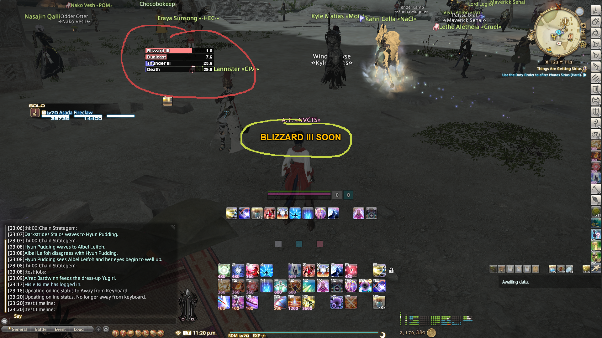
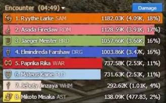

# cactbot (Chromium ACT Bindings Overlay for Things)

1. [About](#about)
2. [UI modules](#ui-modules)
3. [Configuring UI modules](#configuring-ui-modules)
4. [Installing](#installing)
5. [Building from source](#building-from-source)
6. [Writing a cactbot UI module](#writing-a-cactbot-ui-module)
7. [Languages](#languages)

## About

This project is an overlay plugin for
[hibiyasleep's OverlayPlugin](https://github.com/hibiyasleep/OverlayPlugin)
which itself is a plugin for
[Advanced Combat Tracker](http://advancedcombattracker.com/).

It depends on [ravahn's FFXIV ACT plugin](http://www.eq2flames.com/plugin-discussion/98088-ffxiv-arr-plugin.html).

Its goal is to provide log lines, combatant info, dps info, etc.  Everything
that anybody would need to write a good Javascript UI for
[Final Fantasy XIV](http://www.finalfantasyxiv.com/).

## UI modules

The [ui/](ui/) directory has some prebuilt UI modules, and the [resources/](resources/) directory has
building blocks for building your own modules. The modules in [ui/](ui/) are:

### [raidboss](ui/raidboss) module

To use this module, point cactbot at **ui/raidboss/raidboss.html**.

This module provides a visual timeline of upcoming events in a fight, as well as text and audio
notifications to help increase raid awareness. Text and sound alerts can be based on the fight
timeline, or come from log messages that occur in the game, similar to ACT's "Custom Triggers".
The module is designed to look and feel similar to the
[BigWigs Bossmods](https://mods.curse.com/addons/wow/big-wigs) addon for World of Warcraft.

Fight timelines are provided in files designed for the [ACT Timeline](https://github.com/grindingcoil/act_timeline)
plugin, [documented here](http://dtguilds.enjin.com/forum/m/37032836/viewthread/26353492-act-timeline-plugin)
with [some extensions](ui/raidboss/data/timelines/README.txt).

There are three levels of text alerts, in order of escalating importance: `info`, `alert`, and `alarm`.
Text messages will be in one of these, and more important levels are larger and more eye grabbing colors.

Timeline files are found in [ui/raidboss/data/timelines](ui/raidboss/data/timelines). Triggers
for text and sound alerts are found in [ui/raidboss/data/triggers](ui/raidboss/data/triggers).

In this screenshot, the raidboss module is highlighted, with the timeline circled in red, and the
text alerts circled in yellow, with an `alert`-level text message visible.



### [jobs](ui/jobs) module

To use this module, point cactbot at **ui/jobs/jobs.html**

This module provides health, mana, and tp bars, as well as icons and timer bars for big raid buffs such as
The Balance and Trick Attack. It also features a food buff warning to keep up your food buff when leveling
or raiding, and a visual pull countdown.

It has more fleshed out support for some jobs but is strongly a Work In Progress for others.
- Red Mage: Shows white/black mana, tracks procs for Verstone, Verfire and Impact, and shows the state of the melee combo in progress.
- Warrior: Shows the beast amount, and tracks the remaining Storm's Eye buff time.

In this screenshot, the jobs module is highlighted for the Red Mage job. The health and mana bars, as well
as Red Mage white/black mana tracking is circled in purple, with the large raid buff tracking pointed to
beside it in orange. The first step of the melee combo has been executed, which is displayed as the yellow
box above the health bar. The proc tracking is circles below in green.


### [dps](ui/dps) meters

Cactbot can be used with any dps meter overlay designed for OverlayPlugin's miniparse
addon, with the option to build out more features through cactbot's additional Javascript
APIs.

The [xephero](ui/dps/xephero) dps meter is based on the same dps meter built for miniparse,
with the additional ability to do per-phase dps tracking, displayed in additional columns.
In the screenshot below the phases are named B1, B2, B3.  These autogenerate from dungeon bosses, but could be used to differentiate raid fight phases.


The [rdmty](ui/dps/rdmty) dps meter is based on the same dps meter for miniparse, and updated
for Stormblood jobs and recolored to match [fflogs](http://fflogs.com).



Here is a video of some of these UI modules in action on Exdeath and Neo Exdeath, from before
the timelines were added to raidboss:

[](https://www.youtube.com/watch?v=Ot_GMEcwv94)

## Configuring UI modules

Cactbot UI modules can load user settings from the [user/](user/) directory. Simply create
a **user/\<name\>.css** or a **user/\<name\>.js** file, where **\<name\>** is the name of
the UI module, such as [raidboss](ui/raidboss) or [jobs](ui/jobs). These 2 UI modules both
support user settings. After making any changes to these files, pressing the "Reload overlay"
button for the appropriate cactbot in ACT's OverlayPlugin settings will apply the changes.

The **user/\<name\>.css** file can change positions, sizes, colors, etc. for components of
the UI module. See the **ui/\<name\>/\<name\>.css** to find the names of things you can modify.
For example in [ui/raidboss/raidboss.css](ui/raidboss/raidboss.css), you see the
`#popup-text-container` and `#timeline-container` which can be changed via **user/raidboss.css**
to different positions as desired. The size and color of info text alerts can also be changed by
making a CSS rule for the `.info-text` class such as below:

```
.info-text {
  font-size: 200%;
  color: rgb(50, 100, 50);
}
```

The **user/\<name\>.js** file can set options to customize how the UI module works. The
options that can be changed are documented in the `Options` section at the top of the
**ui/\<name\>/\<name\>.js** file. For example in [ui/raidboss/raidboss.js](ui/raidboss/raidboss.js),
you see the `BarExpiresSoonSeconds` option which controls when timeline bars should be
highlighted. You can change that option from the default value to 5 seconds by editing
**user/raidboss.js** to say:

```
Options.BarExpiresSoonSeconds = 5
```

To disable a text/sound alert that comes built-in for a fight, find the trigger's `id` in the files in
[ui/raidboss/data/triggers](ui/raidboss/data/triggers). Then add the `id` to the `Options.DisabledTriggers`
in the **user/raidboss.js** file, such as:

```
Options.DisabledTriggers = {
  'O4S1 Fire III': true,
}
```

To add a sound alert that can be activated in any zone, for example, add the following to **user/raidboss.js**:

```
Options.Triggers = [
  { zoneRegex: /./,
    triggers: [
      // Trick Attack used.
      { regex: /:\y{Name}:\y{AbilityCode}:Trick Attack:/,
        sound: '../../resources/sounds/WeakAuras/RoaringLion.ogg',
      },

      .. other triggers here ..
    ],
  },

  // .. other zones here ..
]
```

A more sophisticated example that shows an alert message after a 1 second delay, but
only when the player's character name appears in the FFXIV log message:

```
Options.Triggers = [
  // .. other zones here ..

  { zoneRegex: /./,
    triggers: [
      // .. other triggers here ..

      { regex: /:(\y{Name}) gains the effect of Forked Lightning from/,
        delaySeconds: 1,
        alertText: 'Forked Lightning: Get out',
        condition: function(data, matches) { return matches[1] == data.me; },
      },

      // .. other triggers here ..
    ],
  },

  // .. other zones here ..
]
```

If you're familiar with regular expressions you'll note the the `\y{Name}` and
`\y{AbilityCode}` are unfamiliar. These are extensions provided by cactbot for
convenience to avoid having to match against all possible unicode characters
or to know the details of how the FFXIV ACT plugin writes things.

The set of extensions are:
- `\y{Name}`: Matches any character or ability name (including empty strings which the FFXIV ACT plugin can generate when unknown).
- `\y{AbilityCode}`: Matches the FFXIV ACT plugin's format for the number code of a spell or ability.
- `\y{TimeStamp}`: Matches the time stamp at the front of each log event such as `[10:23:34.123]`.
- `\y{LogType}`: Matches the FFXIV ACT plugin's format for the number code describing the type of log event, found near the front of each log event.

See this [cactbot-user git repo](https://github.com/quisquous/cactbot-user) for more examples.

## Installing

You must have [.NET Framework](https://www.microsoft.com/net/download/framework) version 4.6 or above installed. You must have [DirectX 11](http://imgur.com/TjcnjmG) enabled for Final Fantasy XIV.

You should already have
[OverlayPlugin](https://github.com/hibiyasleep/OverlayPlugin/releases)
installed and working in
[Advanced Combat Tracker](http://advancedcombattracker.com/).
You must use the [hibiyasleep](https://github.com/hibiyasleep) version of
OverlayPlugin and not the original RainbowMage version, as cactbot depends
on several features of that version.

1. Download the release zip file.
2. Right click on the zip file, and click "Unblock", and then "OK".
3. Unzip the release zip file.
4. Copy the **OverlayPlugin\\** folder from inside of the unzipped
folder on top of your existing **C:\\...\\Advanced Combat Tracker\\OverlayPlugin\\** folder.

   The final directory structure should look something like this:
   - C:\\...\\Advanced Combat Tracker\\
     - Advanced Combat Tracker.exe
     - FFXIV_ACT_Plugin.dll
     - OverlayPlugin\\
       - OverlayPlugin.dll
       - OverlayPlugin.Common.dll
       - OverlayPlugin.Core.dll
       - etc etc OverlayPlugin files
       - addons\\
         - CactbotOverlay.dll
       - cactbot\\
         - ui\\
         - resources\\
         - user\\

Note: The cactbot\\ folder does not have to be located inside of the
OverlayPlugin directory, but that is where it comes by default as part
of a cactbot release zip file.

5. Now add a new overlay in the OverlayPlugin tab in ACT, and choose `cactbot` as the type.
6. In the URL field, browse to an html file to load.
[ui/test/cactbot_test.html](ui/test/cactbot_test.html) is a good place to
to start to make sure everything is set up properly.

### Potential errors and workarounds

If you get an error that it can't find **FFXIV_ACT_Plugin.dll**, make sure the **FFXIV_ACT_Plugin.dll** is in the same directory as **Advanced Combat Tracker.exe**.

If you get an error in the OverlayPlugin console similar to `Exception in SendFastRateEvents: Method not found: 'Void RainbowMage.HtmlRenderer.Renderer.ExecuteScript(System.String)'.` then you are still using the RainbowMage version of OverlayPlugin and need to upgrade to the [hibiyasleep](https://github.com/hibiyasleep/OverlayPlugin/releases) version instead.

If you get a [CAS policy](https://blogs.msdn.microsoft.com/drew/2009/12/23/xunit-and-td-net-fixing-the-attempt-was-made-to-load-an-assembly-from-a-network-location-problem/) error on starting the OverlayPlugin, such as "An attempt was made to load an assembly from a network location which would have caused the assembly to be sandboxed in previous version of the .NET Framework." then this means that you have forgotten to unblock some/all of your DLLs (either hibiyasleep or cactbot).  First, stop ACT.  Then, unblock everything; the easiest way is to unblock the original zip file and re-extract rather than unblocking every file individually.  Finally, restart ACT again.

## Building from source

You should already have
[OverlayPlugin](https://github.com/hibiyasleep/OverlayPlugin/releases)
installed and working in [Advanced Combat
Tracker](http://advancedcombattracker.com/).

Follow the additional installation steps for the .NET framework and
DirectX 11 dependencies above.

1. Follow the instructions in the **dummy.txt** file in [CactbotOverlay/ThirdParty/OverlayPlugin](CactbotOverlay/ThirdParty/OverlayPlugin).
2. Follow the instructions in the **dummy.txt** file in [CactbotOverlay/ThirdParty/ACT](CactbotOverlay/ThirdParty/ACT).
3. Open the solution in Visual Studio (tested with Visual Studio 2017).
4. Build for "Release" and "x64".
5. The plugin will be built as **bin/x64/Release/CactbotOverlay.dll**.
6. Copy the plugin to the Advanced Combat Tracker\\OverlayPlugin\\addons\\ directory

## Writing a cactbot UI module

To build a cactbot ui, you need to make a **.html** file and point cactbot at it. There are a
number of helpful things in the [resources/](resources/) directory.

Include the [resources/defaults.css](resources/defaults.css) file to get some of the default
look and feel of other cactbot uis, then use the `.text` class on any HTML elements which contain
text. You may add the `.hide` class to elements you do not want shown, and remove it when they
should be visible.

Include the [resources/resize_handle.css](resources/resize_handle.js) and
[resources/resize_handle.js](resources/resize_handle.js) files to give visual feedback to the
user when the module is unlocked for moving and resizing.

Include the [resources/unicode.js](resources/unicode.js) file to use unicode categories in
regular expressions in order to support non-english characters.

There are a number of web components that provide widgets for building your ui, including the
[timerbar](resources/timerbar.js), [timerbox](resources/timerbox.js) or
[resourcebar](resources/resourcebar.js). Include the file and then instatiate it by making an
element of that type, such as `<timer-bar></timer-bar>` or `<resource-bar></resource-bar>`.

The set of Javascript events that can be listened for via `document.addEventListener` is found
in [CactbotOverlay/JSEvents.cs](CactbotOverlay/JSEvents.cs). The public fields of each event
type will be members of the event's `detail`. See the
[ui/test/cactbot_test.html](ui/test/cactbot_test.html) ui module for a simple example of
listening to and using the Javascript events.

## Languages

Cactbot is tested and works with the English version of Final Fantasy XIV.

Unicode characters are supported thoughout, through the use of the helpers in the
[resources/regexes.js](resources/regexes.js) file. However [timelines](ui/raidboss/data/timelines)
and log event [triggers](ui/raidboss/data/triggers) may be incorrect if names that appear in the
ACT log events are different.
